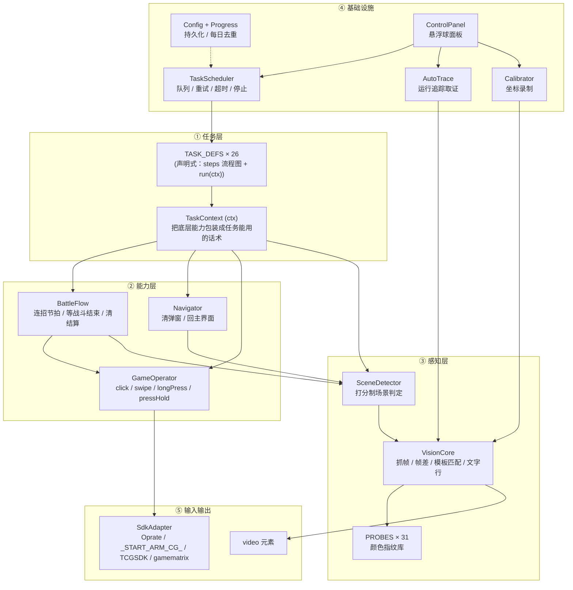
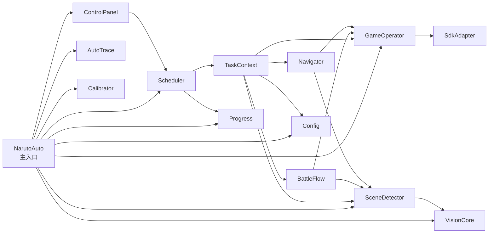
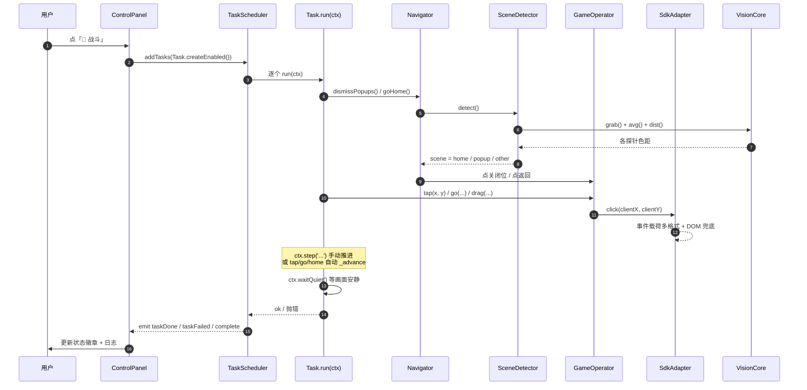
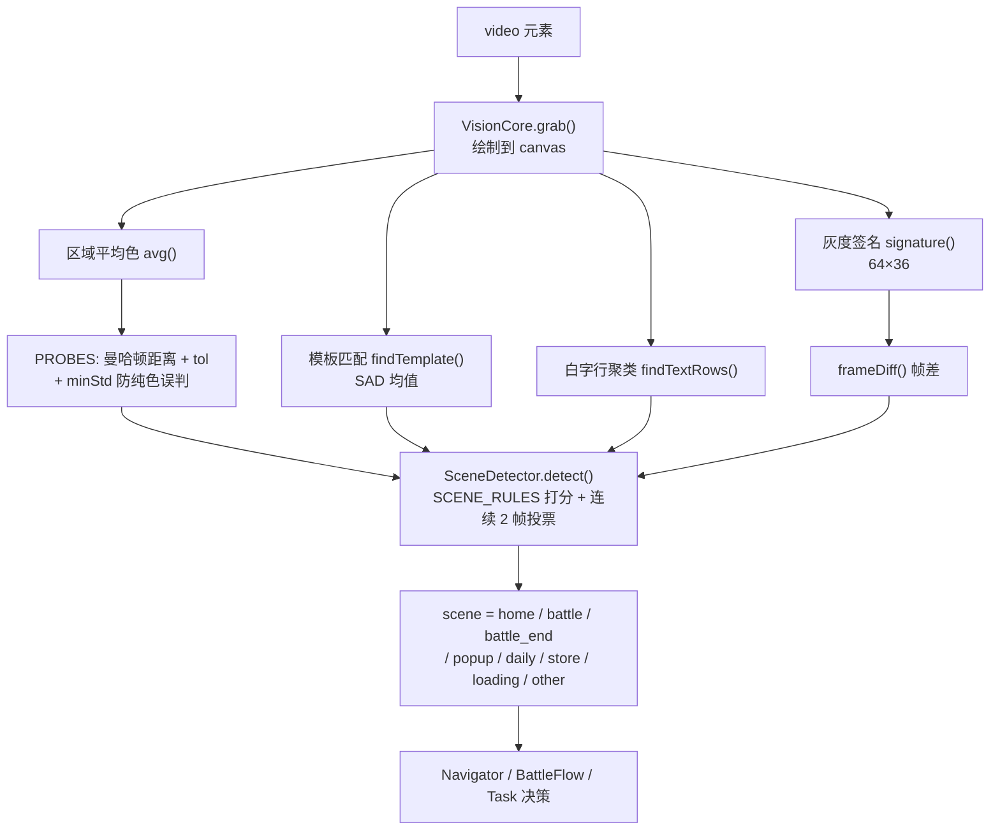

# 架构与图谱

> 适用于 **v0.5.81**。行号为该版本实测值，改版后会漂移 —— 定位代码请优先用符号搜索（类名/常量名），不要死记行号。

## 1. 概览

整个项目是**一个单文件油猴脚本** `naruto-auto.user.js`（约 7,400 行 / 449 KB），运行在浏览器里，
通过云游戏 SDK 模拟点击/滑动，靠**截图分析**判断"现在在哪个界面"。

```
┌──────────────────────────────────────────────────────────┐
│  浏览器 (Tampermonkey)                                     │
│  ┌────────────────────────────────────────────────────┐  │
│  │  naruto-auto.user.js                               │  │
│  │  任务层 → 能力层 → 感知层 / 输入层                    │  │
│  └────────────────────────────────────────────────────┘  │
│         ↓ 输入                                    ↑ 画面   │
│  ┌──────────────┐                        ┌──────────────┐ │
│  │ 云游戏 SDK    │                        │ <video> 元素  │ │
│  └──────────────┘                        └──────────────┘ │
└──────────────────────────────────────────────────────────┘
```

**设计取舍（重要）**：所有代码放一个文件，不为别的，只因为 Tampermonkey 的分发单位就是单文件
（`@updateURL` 指向一个 .js）。**没有构建步骤**，改完直接推给 Tampermonkey 就算上线。

## 2. 分层架构



**分层的意义**：任务层只写"业务"（点哪、等什么），不碰坐标换算、不发原始事件、不做像素计算。
判断"能不能动手"和"现在在哪"全部下沉到能力层与感知层。

## 3. 运行时对象图谱



所有对象挂在 `window.__narutoAuto` 上，可在控制台直接取用（见 README 的「控制台快捷 API」）。

## 4. 一次任务执行的完整数据流



### 关键约定

- `steps[]` 是**流程图声明**，只用来展示进度；`run()` 里用 `ctx.tap/go/home/drag` 会自动推进，
  其它动作（如自己调 `ctx.op`）**必须手动 `ctx.step('说明')`**，否则流程图和实际不同步。
- 助手/循环内部的不定次点击一律用 `ctx.op.clickNatural(x, y, null, label)` —— `ctx.tap` 会推进
  流程图索引，循环里用会让阶段整体错位。

## 5. 视觉判定链



三种手段可靠性递进，**能用探针就别用模板，能用模板就别用文字行聚类**：

| 手段 | 适用 | 实现 | 阈值 |
|---|---|---|---|
| 颜色探针 | 按钮、横幅、面板（大色块） | `PROBES` + `avg/dist` | `tol` 曼哈顿距离（多数 35，`defeatBanner` 收紧到 25） |
| 模板匹配 | 文字、小图标 | `findTemplate` 灰度 SAD | 25 |
| 文字行聚类 | 模板失效时的兜底 | `findTextRows` | grayMin 170 / satMax 60 / gap 8 / minCount 3 |
| 帧差 | "画面动没动" | `frameDiff` | 0.012（默认）；自检类判据见下方说明 |

### SCENE_RULES 的判定顺序（不可随意调换）

```
BATTLE_END (victoryBanner / defeatBanner / squadVictory, min 1)
  → BATTLE (battleStick / battleSkill, min 2)
  → HOME   (avatar / storeIcon / mailIcon / dailyIcon, min 2)
  → OTHER  (backBtnX, min 1)
  → POPUP  (closeX / closeGray / closeRed, min 1)
  → DAILY  (titleDaily)  → STORE (titleStore)
```

顺序踩过的坑（都写在脚本注释里）：

- **HOME 必须先于 OTHER**：主界面右上角红色「活动」图标与二级页红 ✕ 位置几乎重合，动态红 ✕ 检测器在主界面
  也会命中 → 若 OTHER 先判，主界面会被当成"其它页"，`goHome()` 又去点 `(1218,42)` 把活动页重新打开，形成死循环。
- **HOME 用 min:2**：忍法帖页左上角红金图案恰与 `avatar` 探针压线误命中（dist 32 / tol 35），
  min:1 会让二级页被误判成主界面 → `goHome()` 第一步就假成功返回。
- **`settleConfirm` 已从 BATTLE_END 移除**（0.5.70）：该探针在战斗地面/技能区误报率极高，
  会把正常战斗帧误判为结算 → `waitForEnd` 提前返回。它仍作为独立命中在 `clearSettlement` 里使用。

> ⚠️ **`SCENE.DAILY` / `SCENE.POPUP` 不能当作"我在哪个页面"的依据**。
> 实测一份 2000 拍的战斗 trace 里，`daily` 误命中 10 次、`popup` 误命中 27 次。
> 判断"是不是某页面"只能靠专用探针或**行为自检**（点一下看画面动没动）。

## 6. 坐标系

- 所有坐标基于 **1280×720 逻辑空间**定义，运行时按 `videoWidth × videoHeight` 换算。
- `frameDiff` / `signature` 用 **64×36 缩略帧**；`AutoTrace` 存档的缩略帧是 **320×180**（= 基准的 1/4，换算系数 **S = 0.25**）。
- 战斗里的 `j` / `i` / `k` / `o` / `e` / `r` / `a` / `d` / `space` 是**屏幕位置**，不是键盘按键
  （2026-09-13 起战斗辅助全部走位置点击，因为部分云游戏实例键盘通道不可靠）。

## 7. 任务系统

### TASK_DEFS 结构

```js
{
  key: 'collectMail',        // 唯一 ID，配置开关 taskSwitches[key] 用它
  name: '邮件领取',           // 面板显示名
  category: 'collect',       // daily | collect | weekly | battle
  timeout: 300000,           // 可选，单任务超时（缺省用 runtime.taskTimeout）
  hangLoop: true,            // 可选，常驻循环任务（不参与「跑全部」兜底）
  steps: ['回主界面', '...'], // 画面流程图声明（展示用）
  async run(ctx) { ... }     // 实际逻辑
}
```

### 分类与执行顺序

| 分类 | 数量 | 键 | 面板顺序 |
|---|---|---|---|
| ⚔ 日常 | 9 | `daily` | RANK 0 |
| 🎁 收获 | 8 | `collect` | RANK 1 |
| 📅 周常 | 6 | `weekly` | RANK 2 |
| 🥊 战斗 | 3 | `battle` | RANK 3 |

- 执行顺序 = **分类 RANK → 分类内数组顺序**。日常必须全部排在收获之前（用户明确要求，有静态回归测试 `tools/task-order-check.cjs` 守着）。
- **`battle` 组不记「当天已做过」**：`Progress.tracked()` 对 battle 返回 false —— 用户点了就是要跑。
- `missionHall` 物理排在 `TASK_DEFS` **最末尾**：它是 8 小时常驻循环，排在中途会把秘境/角斗场饿死。
- 新增任务开关的默认值：`weekly` 默认**关**，其它默认**开**（`Config` 迁移段自动补齐）。

### 26 个任务清单（v0.5.81）

<details>
<summary>展开完整清单</summary>

**日常 daily (9)**：`sendStamina` 赠送体力、`ichiraku` 一乐拉面、`equipSweep` 精英副本、`orgBlessing` 组织祈福、
`abundanceRoom` 丰饶之间、`squadRaid` 小队突袭、`squadAssist` 小队突袭助战、`survivalTrial` 生存试炼、
`scoreMatchClaim` 积分赛段位领取

**收获 collect (8)**：`collectGold` 招财、`collectMail` 邮件领取、`collectSign` 每日签到、`shareDaily` 每日分享、
`collectRank` 排行榜点赞、`privilegeShop` 特权商店、`recruit` 免费招募、`collectActive` 活跃度宝箱

**周常 weekly (6)**：`collectNinjutsu` 忍法帖点赞、`roadOfPractice` 修行之路、`chaseAkatsuki` 追击晓组织、
`rebelNinja` 叛忍来袭、`orgFortress` 组织要塞、`heavenEarth` 天地战场

**战斗 battle (3)**：`arenaBattle` 角斗场忍术对战、`secretRealm` 秘境挑战、`missionHall` 任务集会所（常驻）

</details>

## 8. 战斗子系统（BattleFlow）

战斗是本项目最难的部分。核心入口 `waitForEnd(opts)`：**`opts` 是按场覆盖表，不传 = 老行为**，
所以改它不影响没传参的任务。

| opts | 默认 | 角斗场 | 作用 |
|---|---|---|---|
| `vsConfirm` | 3 | 2 | 横幅需连续命中拍数 |
| `strongBanner` | off | true | 金色横幅单拍强命中（dist ≤ 20）直接落判 |
| `blackWindowMs` | 12000 | 4000 | 「近 N ms 内出现过黑屏」序列确认窗口 |
| `noDefeat` | off | true | 屏蔽「失败」探针（登场画面会连续误命中） |
| `staticEndAfterMs` | 0 | 40000 | 本场不足 N ms 且近期无横幅 → 静止不判结束 |
| `stableEndFrames` | 3 | 8 | 静止确认拍数（≈2.4s） |
| `bannerRecencyMs` | 30000 | 30000 | 「近期有横幅」窗口 |
| `bannerGraceMs` | 0 | 6000 | 横幅后**观察窗**：续局 or 真打完 |
| `assistMaxMs` | 150000 | 300000 | 单场连招总时长上限 |
| `maxWaitMs` | 180000 | 360000 | 单场等待上限 |
| `staticBailMs` | 0 | 20000 | 画面连续静止 ≥N 无条件结束本场 |
| `darkEndAfterMs` | 0 | 25000 | 本场 ≥N 后出现全屏黑 → 立刻判整场结束 |

返回值：`settlement` / `home` / `stable` / `frozen` / `darkend` / `timeout`。

### 判据的"分档"原则（v0.5.81 的核心结论）

全屏亮度在三档之间分得很开 —— **不要二值化，先量区间再分档**：

| 状态 | 全屏亮度 BR |
|---|---|
| 战斗中 | **100+**（从没黑过） |
| 小局切换（暗帧） | **14.0 ~ 22.3** |
| 整场结束（全屏黑） | **1.3 ~ 5.3** |

### 自检类判据要显著高于背景漂移

「点一下看画面动没动」的阈值必须比**该页面自身动画**高一个数量级：

| | 实测 diff |
|---|---|
| 无效点击（页面自身动画） | 0.0149 / 0.0104 / 0.0107 |
| 真点到东西 | 0.5676 / 0.3220 |

→ `REACT = max(THR × 3, 0.05)`，两侧余量 3.4× / 6.4×。用默认 `THR=0.012` 会把盲点全判成"点到了"。

## 9. 配置与持久化

- `Config` 走 `GM_setValue` / `localStorage` 双通道，`_merge` 深合并。
- ⚠️ **改 `DEFAULT_CONFIG` 对老配置无效** —— `_merge` 以**已存值**为准。要让老用户生效必须在 `_load()` 的迁移段显式抬。
- 操作间隔铁律：**任何两步之间 ≥1s**。总闸 `MIN_OP_DELAY`(1000) + `Config.wait()` 强制，
  `ctx.tap/go/drag` 都收尾于 `delay.click`。
- ⚠️ **战斗按键节拍绝不能拉长**：`ASSIST.kGap(200)` / `burstGap(120)` / `sub(400)` / `jiFast(500)`
  是连招节奏，战斗不走 `cfg.wait`，天然豁免于上面那条 ≥1s 规则。

## 10. 代码地图（改哪里找哪里）

| 想改什么 | 去哪 |
|---|---|
| 任务开关 / 任务列表 | `TASK_DEFS`（`const TASK_DEFS = [` 搜） |
| 任务流程 | 对应任务的 `async run(ctx)` |
| 新增/修改 UI 颜色指纹 | `PROBES`（搜 `const PROBES = {`） |
| 场景判定规则 | `SCENE_RULES`（搜 `const SCENE_RULES = [`） |
| 点击坐标 | `COORDS`（搜 `const COORDS = {`） |
| 任务的业务坐标（如集会所） | 任务自己的常量块（如 `MISSION`） |
| 战斗节拍 | `BattleFlow` 的 `combatStep` + `ASSIST` 常量 |
| 等战斗结束的判据 | `BattleFlow.waitForEnd` |
| 默认配置项 | `DEFAULT_CONFIG` |
| 老配置迁移 | `Config._load()` 里的迁移段 |
| 面板 UI | `UI_CSS` + `ControlPanel._html()` |
| 视觉底层 | `VisionCore` |
| 输入底层 | `SdkAdapter` |

### 关键行号（v0.5.81 时点，会漂移）

| 行 | 内容 |
|---|---|
| 1–31 | userscript 头（`@version` 在第 4 行） |
| 27 | `const VERSION`（⚠ 与 `@version` 必须同步） |
| 35–143 | `AbortError` / `Runtime` / `Utils` |
| 189 | `DEFAULT_CONFIG` |
| 307 / 412 | `Config` / `Progress` |
| 479 | `SdkAdapter` |
| 1054 | `VisionCore` |
| 1416 | `PROBES`（31 个） |
| 1515 / 1545 | `SCENE` / `SceneDetector` |
| 1643 | `COORDS` |
| 1736 / 1883 | `Marks` / `AutoTrace` |
| 2303 / 2426 | `GameOperator` / `Navigator` |
| 2602 | `BattleFlow` |
| 3141 | `TaskContext` |
| 3543 | `MISSION`（任务集会所常量块） |
| 4148 | `TASK_DEFS`（26 个任务） |
| 5579 / 5643 | `Task` / `TaskScheduler` |
| 5778 | `Calibrator` |
| 6252 | `ControlPanel` |
| 7118 | `NarutoAuto` 主入口 |

## 11. 相关文档

- [交接文档](../HANDOFF.md) —— 接手前必读
- [开发指南](development.md) —— 环境、改代码流程、加新任务
- [任务流程参考](task-flow.md) —— 每个任务的游戏内操作步骤
- [常见问题](faq.md)
- [版本记录](../CHANGELOG.md)
